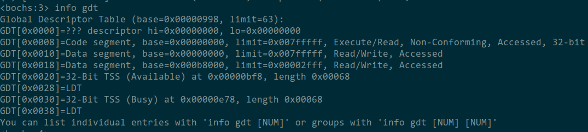
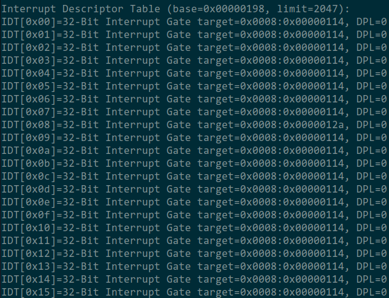
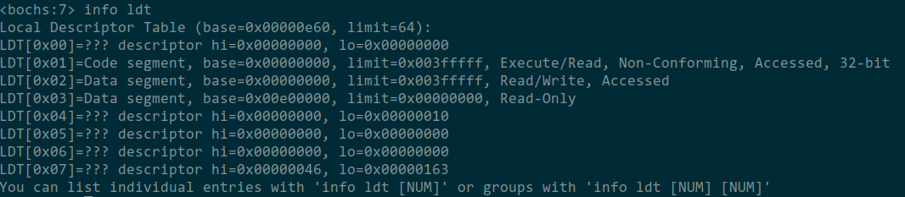
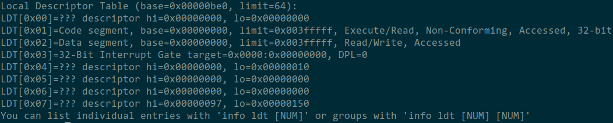
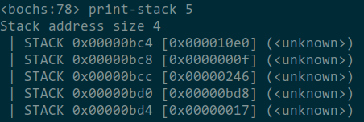
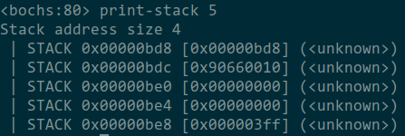
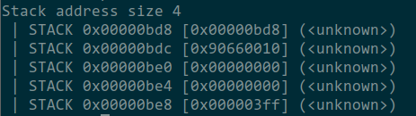
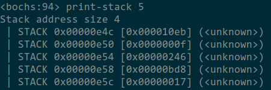

# 调试分析 Linux 0.00 引导程序 实验报告

## 简述 head.s 的工作原理
head.s 重新建立IDT，设置定时器中断和系统调用。建立GDT表，建立两个任务的TSS，为这两个任务分别初始化IDT，然后通过手动构造中断返回时栈的场景，来切换到新任务的执行环境。然后在每次定时器中断时切换任务。
head.s 中所有表的建立都是静态的。而不是动态创建和删除的。

## 记录 head.s 的内存分布状况，写明每个数据段，代码段，栈段的起始与终止的内存地址

- GDT
    

    使用``info gdt``查看GDT信息。
    1. 0x0008 32位代码段，可执行可读，DPL=3，基址为0x00000000，段限长为3FF，颗粒度为4KB。即0x003FFFFF为终止地址。
    2. 0x00010 32位数据，可读可写，DPL=3，基址为0x00000000，段限长为3FF，颗粒度为4KB。即0x003FFFFF为终止地址。
    3. 0x00018 32位数据，可读可写，DPL=3，基址为0x000B8000，段限长为2FFF，颗粒度为1B。即0x000BAFFF为终止地址。

- IDT
    

    使用``info idt``查看IDT信息。表太长，因此仅展示部分信息。
    可看出基址0x198，段限长2047，终止地址为0x997。

### 任务0的LDT分析

使用``info ldt``查看当前LDT信息，任务0中有两个有效的段：

- segment 1
    32位代码段，可执行可读，DPL=3，基址为0x00000000，段限长为3FF，颗粒度为4KB。即0x003FFFFF为终止地址。

- segment 2
    32位数据段，可读可写，DPL=3，基址为0x00000000，段限长为3FF，颗粒度为4KB。即0x003FFFFF为终止地址。

### 任务1的LDT分析

使用``info ldt``查看当前LDT信息，任务1中有两个有效的段：

- segment 1
    基址为0x00000000，代码段，可执行可读，DPL=3，32位段，段限长为3FF，颗粒度为4KB。即0x003FFFFF为终止地址。

- segment 2
    基址为0x00000000，数据段，可读可写，DPL=3，32位段，段限长为3FF，颗粒度为4KB。即0x003FFFFF为终止地址。

    和任务0的值是一致的。

## 简述 head.s 57 至 62 行在做什么？
57至62行在特权级的切换，并跳转到任务0中执行。具体而言就是利用iret中断返回指令的特性，在栈上手工构造一个返回环境（按顺序压入任务0的数据段选择子（用作栈段），堆栈指针，标志寄存器，任务0的代码段选择子，任务0的入口地址），假装是由任务0跳转过来的。从而iret就会完成到特权级3，控制流到任务0的切换。

## 简述 iret 执行后， pc 如何找到下一条指令？
iret 先从栈中弹出两个值，一个是返回代码段的段选择子，另一个是返回eip，即pc的值，iret会在进行一系列特权级检查后，将新的段选择子和eip加载。这就找到了下一条指令的PC。除此之外，还会弹出eflags，根据返回的特权级还有可能弹出返回的堆栈的段选择子和栈顶指针，这里必然弹出。

## 记录 iret 执行前后，栈是如何变化的？

``iret``执行前，栈上是人工构造的中断返回场景，返回后这些值被弹出。也进行了栈的切换，即栈顶变成了原来内核刚启动时的位置。至于``iret``前压入的五个值的含义，见前两问。

## 当任务进行系统调用时，即 int 0x80 时，记录栈的变化情况。

``int 80``执行前，栈上没有有意义的数据，执行后用户栈也没有变化。

``int 80``执行后，内核栈压入了五个数据，是中断返回eip和段选择子，保存的标志寄存器，返回的堆栈段选择子和栈顶指针。顺序和前三问描述的构造中断返回场景时的压栈顺序一致。
