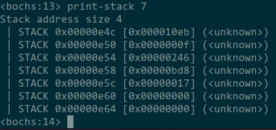
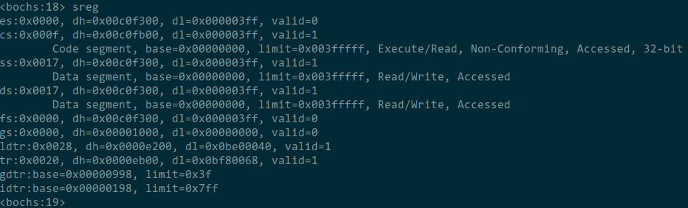
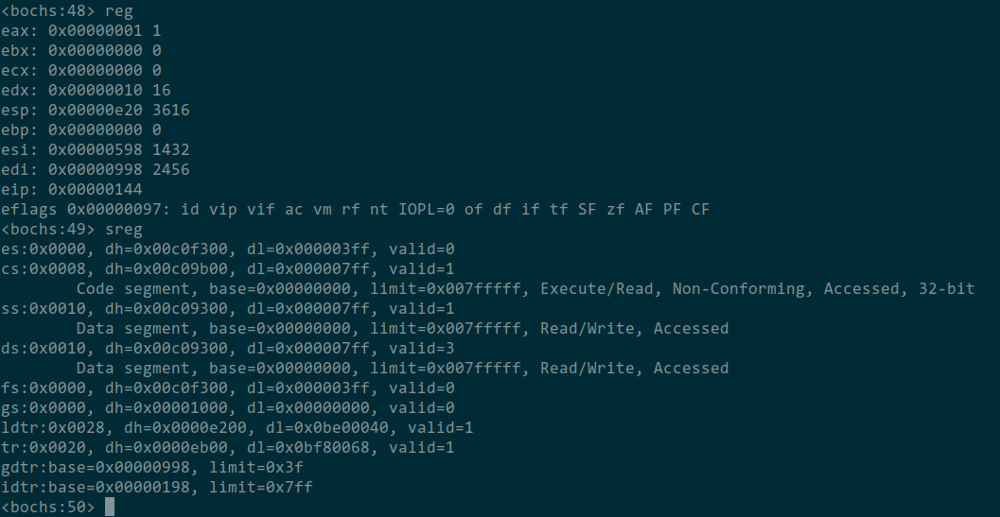
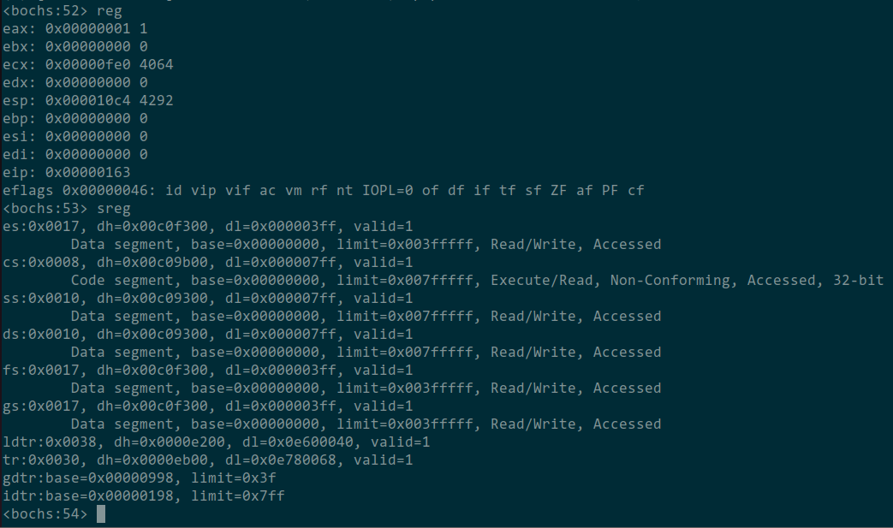
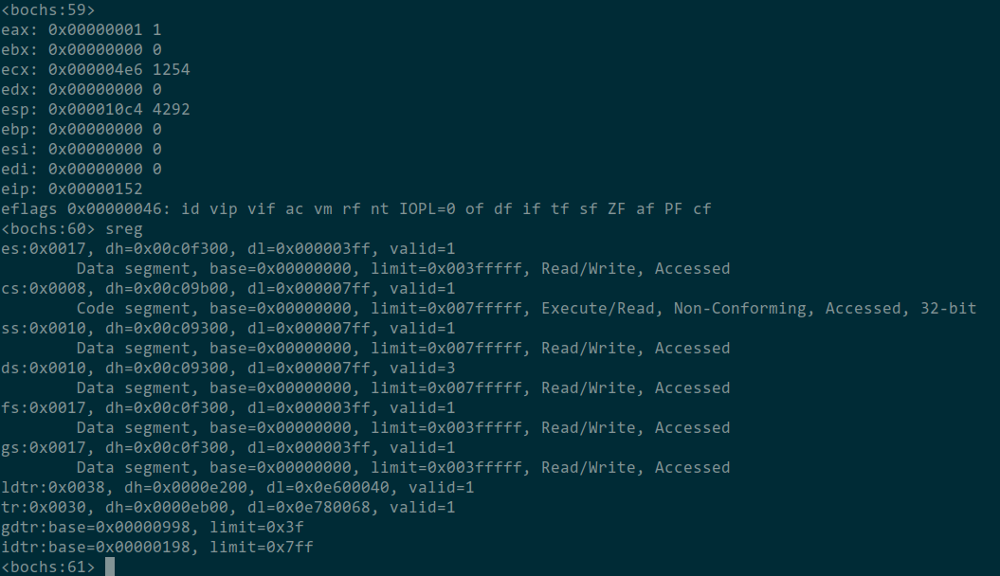
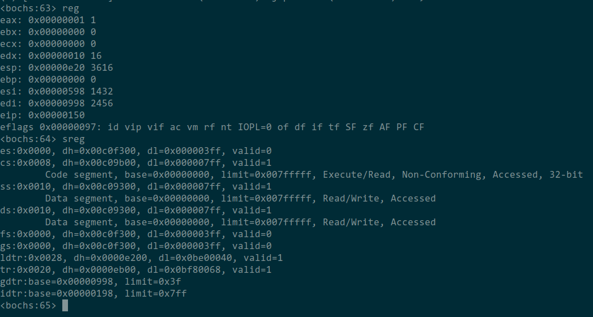

# 调试分析 Linux 0.00 任务切换 实验报告

## 当执行完system_interrupt, 执行153行iret时，记录栈的变化情况。
在执行iret之前，栈的内容如图所示：

栈顶五个元素，从上至下为，返回指令指针eip，返回代码段选择子cs，保存的标志位的值，返回的栈顶指针esp，返回的栈段选择子ss。

返回后，上述值都加载进了对应寄存器。

## 当进入和退出 system_interrupt 时，都发生了模式切换，请总结模式切换时，特权级是如何改变的？栈切换吗？如何进行切换的？

当进入system_interrupt时，先进行特权级检查，确认可以访问后，将第一问提到的5项压栈后，切换到对应代码段，此时特权级发生了改变，从原来的3变成了0，从system_interrupt返回时，将压栈保存的内容弹出并加载到对应寄存器中，此时切换到了原来的代码段，特权级从0变为了3.

但特权级切换时，若切换后的原特权级与目标特权级不同，则栈会发生切换。

栈是这样切换的，执行int指令时，发现了目标特权级高于特权级，因此要切换到对应特权级的堆栈，要切换到的堆栈段选择子和栈顶指针在TSS中，同时在新堆栈中不止压入eip，cs，eflag，还会压入旧的栈段选择子和栈顶指针。
从中断程序返回时，检查到返回到了较低特权级，因此会将栈中保存的原堆栈的段选择子和栈顶指针弹出并加载进对应寄存器中。

## 当时钟中断发生，进入到 timer_interrupt 程序，请详细记录从任务 0 切换到任务 1 的过程。

在执行任务切换时需要切换到内核态的数据段，因此使用新的数据段选择子0x10。

运行到切换任务的指令（ljmp TSS_SEL1, 0）时，此时处理器各寄存器的值如图所示：

切换时，处理器会将当前寄存器的值都保存到当前任务的TSS中。并将目标任务的TSS段中的内容加载到寄存器中，如图所示：

观察到当前的TR确实变成了任务1的TSS 0x30。
此时程序从上次任务1中断的位置开始执行。如果是第一次切换到任务1，则执行状态是任务1TSS的预定义的值。

在真正执行切换前，程序还将任务号1保存到了current中。

## 又过了 10ms，从任务1切换回到任务 0，整个流程是怎样的？ TSS 是如何变化的？各个寄存器的值是如何变化的？

在执行任务切换时需要切换到内核态的数据段，因此使用新的数据段选择子0x10。

运行到切换任务的指令（ljmp TSS_SEL0, 0）时，此时处理器各寄存器的值如图所示：

切换时，处理器会将当前寄存器的值都保存到当前任务的TSS中。并将目标任务的TSS段中的内容加载到寄存器中，如图所示：

观察到当前的TR确实变成了任务1的TSS 0x20。
此时程序从上次任务0中断的位置开始执行。
例如上一问的图片中可看到切换前，原esp为0xe20，现在切换回任务0后，esp也变回了0xe20。
实际上此时控制流回到了上次任务0中断的地方，也即任务0调用ljmp切换到任务1的那条指令的下一条指令。然后从栈中弹出保存的eax和ds。恢复任务0用户态的执行。

在真正执行切换前，程序还将任务号0保存到了current中。

## 请详细总结任务切换的过程。

1. 时钟中断触发：任务切换通常是由系统中的时钟中断(timer_interrupt)触发的。时钟中断以固定的时间间隔（每10毫秒）发生一次，它是多任务处理的触发点。

2. 保存当前任务上下文：当时钟中断触发时，会执行时钟中断处理程序。处理程序先保存用到的寄存器eax和ds。（中断也会在内核栈中压入程序断点信息，见第一问和第二问的描述）

3. 执行ljmp指令跳转到一个TSS选择子。这会将当前执行的任务的寄存器信息保存到当前任务的TSS中，并将新TSS中的寄存器值加载到寄存器中，TR也会变成新TSS的选择子的值。

4. 新任务开始执行：此时执行环境已经完全切换到新任务的环境，处理器开始执行新任务。

下次又切换回这个任务时，实际上回到的控制流位置是在timer_interrupt中的，这时从ljmp指令后开始执行，弹出保存的eax和ds，然后执行中断返回继续执行任务。
