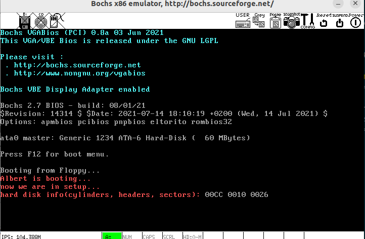

# 操作系统的引导 实验报告

## 回答问题

##### 有时，继承传统意味着别手蹩脚。 x86 计算机为了向下兼容，导致启动过程比较复杂。 请找出 x86 计算机启动过程中，被硬件强制，软件必须遵守的两个“多此一举”的步骤（多找几个也无妨），说说它们为什么多此一举，并设计更简洁的替代方案。

1. 实模式和保护模式切换：在x86计算机启动时，CPU一开始处于实模式下工作，具有一些限制，如只能寻址1MB的内存等。为了进入更高级的保护模式，必须执行一系列复杂的步骤，包括设置段描述符、开启A20门、加载全局描述符表（GDT）等。
    可以启动时就保护模式下运行。

2. 实模式下的实模式中断向量表（IVT）初始化：在x86计算机启动时，BIOS会初始化一张中断向量表，然而这个中断向量表在现代操作系统引导中只会有少数几个会用到，且进入保护模式后，整个表会被舍弃。
    可以只提供操作系统引导所必要的调用。或者硬件的初始化也交由引导程序来做。

## 实验内容

### 实验结果展示



我为系统起的名就是``XXX``。如上图所示，bootsect 显示正确，bootsect 正确读入 setup，正确的显示了 ``now we are in setup...``，setup获取硬件参数并输出（硬盘）。

### 关键代码解释
代码用as的AT&T格式汇编写成，因为这样可以直接使用linux-0.11的Makefile来编译，更加的方便。完整代码在code目录下。

1. 输出``XXX is on booting...``
```asm
    # read current cursor position
    mov $3, %ah
    xor %bh, %bh
    int $0x10 # now cursor position is in dh and dl
    
    # write string
    .equ msglen, endmsg - msg
    mov $msglen, %cx
    mov $msg, %bp
    mov $0x0c, %bl
    mov $0x00, %bh
    mov $0x13, %ah
    mov $0x01, %al  # move cursor
    int $0x10
```
前四行使用BIOS中段0x10的3号功能获取当前光标位置，后面将字符串长度放入cx，字符串首地址放入bx，bh是页号,bl是属性，这里是亮红色。al为1，标识光标跟随移动。

2. bootsect加载setup
```asm
    load_setup:
    mov $0x02, %ah
    mov $2, %al  # load two sectors
    mov $0, %dh  # driver 0
    mov $0, %dl  # head 0
    mov $0x0002, %cx # sector 2, track 2
    mov $0x0200, %bx # put the setup after boot
    int $0x13
    jnc ok_load
    # failed, reset floppy driver
    mov    $0x0000, %dx
    mov    $0x0000, %ax
    int    $0x13
    jmp load_setup

    ok_load:
    ljmp $BOOTSEG, $512
```
使用0x13号中断的功能2，al置2，标识加载两个扇区，dh置0，标识0号驱动器，dl置零，表示0号磁头，cx置0x0002，表示起始扇区为2磁道的2扇区，将bx置为0x0200（256），表示将加载的扇区放在紧接着bootsect之后。
如果CF标志位被置位，则表示加载失败，此时复位软盘重新加载。否则就跳转至setup起始位置执行。

3. setup.s 的输出
setup的输出被包装成各种函数，调用约定是，参数依次按顺序放入bx,cx,dx。

- print_str：将bootsect的拷贝过来做一些修改即可。
```asm
    # %bx length
    # %cx address
    print_str:
    push %bp
    push %ax
    push %cx
    # set string length and address
    mov %bx, %bp

    # read current cursor position
    mov $3, %ah
    xor %bh, %bh
    int $0x10 # now cursor position is in dh and dl

    pop %cx
    # write string
    mov $0x0c, %bl
    mov $0x00, %bh
    mov $0x13, %ah
    mov $0x01, %al  # move cursor
    int $0x10
    pop %ax
    pop %bp
    ret
```

- print_hex：使用循环左移来每次处理四位，将这四位对应的字符输出即可。
```asm
    # %bx number

    print_hex:
    push %ax
    mov    $4, %cx
    print_digit:
    rol   $4, %bx
    mov   $0xe0f, %ax
    and   %bl, %al
    add   $0x30, %al
    cmp   $0x3a, %al
    jl     outp
    add    $0x07, %al
    outp:
    int    $0x10
    loop   print_digit
    pop %ax
    ret
```

- print_nl：调用print_str打印只含换行的字符串。

4. setup 获取硬盘参数
```asm
    # get harddisk parameter
    cld
    xor %ax, %ax
    mov %ax, %ds
    lds 0x0104, %si
    mov $hdisk_param, %di
    mov $16, %cx
    rep movsb
```
首先``cld``用来清除方向标志位，这样可以保证后面的rep movsb是向正方向增长的。
然后我将其保存在了setup中定义的如下位置：
```asm
        hdisk_param:
    cylinders:  .word 0
    headers:    .word 0
                .word 0
                .word 0
                .word 0
                .word 0
                .word 0
    sectors:    .byte 0, 0
```
至于参数的来源，BIOS会设置0x41号中断向量位置为一个硬盘参数表的指针，将0x41号中断向量位置的指针加载进ds和si即可。
之后设置cx为16表示执行rep movsb 16次。

5. 参数的输出
先打印提示信息，然后依次加载要打印的值，调用``print_hex``打印即可。
```asm
    mov cylinders, %bx
    call print_hex

    mov $0x20, %al
    mov $0x0e, %ah
    mov $0x07, %bl
    int $0x10
    xor %bx, %bx
    mov headers, %bl
    call print_hex

    mov $0x20, %al
    mov $0x0e, %ah
    mov $0x07, %bl
    int $0x10
    xor %bx, %bx
    mov sectors, %bl
    call print_hex
```
直接从上面保存的位置提取数值，调用``print_hex``打印即可。
在每两次打印之间要打印一个空格字符增强可读性。

### 结果正确性检验
在bochs的启动配置文件中有如下一行:
```asm
    ata0-master: type=disk, path="$OSLAB_PATH/hdc-0.11.img", mode=flat, cylinders=204, heads=16, spt=38
```

对比实验结果可见，``cylinder``，``headers``，``sectors``都是正确的。
