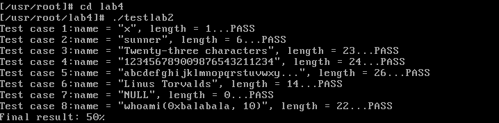
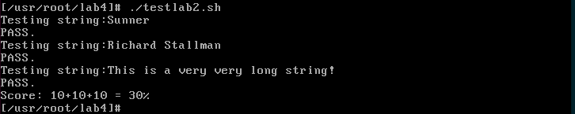

# 系统调用 实验报告

## 回答问题

##### 从 Linux 0.11 现在的机制看，它的系统调用最多能传递几个参数？
3个。因为_syscallX宏只提供到三个参数。

##### 你能想出办法来扩大这个限制吗？
1. 通过压栈来传递更多的参数。由于系统调用在内核态，用户准备的参数在用户态，如果要用压栈来传递只能压在用户态的栈中，此时系统调用的处理代码可以根据保存的用户态的esp来找到参数。

2. 通过一片缓冲区来传递。将所有参数按一定顺序放在一个缓冲区中，参数只需传缓冲区首地址即可。系统调用处理代码可以根据首地址从用户态获得所有参数。实际上，实践上这个缓冲区往往都是定义好的结构体。

##### 用文字简要描述向 Linux 0.11 添加一个系统调用 foo() 的步骤。
1. 首先，修改include/unistd.h文件，使其包含__NR_<name>宏，并分配一个相应的系统调用号。

2. 在includenux/sys.h中加上extern int sys_<name>，并在sys_call_table中加入对应的函数指针。注意函数指针在表的位置要与系统调用号对应好。

3. 在kernel/system_call.s中将nr_system_calls变量加一。
4. 增加kernel/<name>.c文件，实现sys_<name>函数，注意数据在用户态和内核态之间的传递。
5. 修改kernel/Makefile文件，在OBJS处加入<name>.o，在Dependencies中加入 <name>.s <name>.o: <name>.c ../includenux/kernel.h ../include/unistd.h

## 实验内容

### 实验代码
完整代码在``./code``目录下。

先定义一个宏：
```c
#define WHO_NAMELEN (23)
```

在内核空间中定义一个名字的缓冲区。
```c
static char name_buf[WHO_NAMELEN + 1] = "";
```

``iam``的实现：
```c
int sys_iam(const char* name) {
  char tmp_buf[WHO_NAMELEN + 1];
  char ch = 0;
  int len = 0;
  while (len <= WHO_NAMELEN && (ch = get_fs_byte(name + len)) != '\0') {
    tmp_buf[len++] = ch;
  }

  if (len > WHO_NAMELEN)  /* name too long */
    return -EINVAL;

  tmp_buf[len] = '\0';
  strcpy(name_buf, tmp_buf);
  return len;
}
```

``whoami``的实现：
```c
int sys_whoami(char* name, unsigned int size) {
  unsigned int len = 0;
  while (len < size && name_buf[len] != '\0') {
    put_fs_byte(name_buf[len], name + len);
    ++len;
  }

  if (len >= size)  /* buffer overflow */
    return -EINVAL;

  put_fs_byte('\0', name + len);
  return len;
}
```

### 实验结果展示




